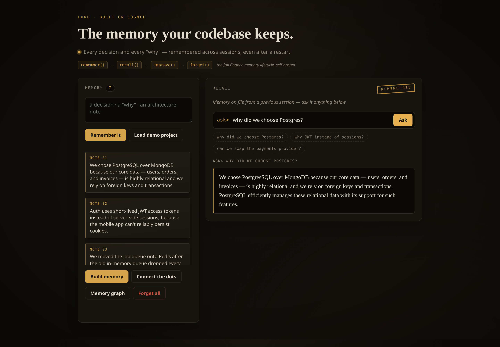
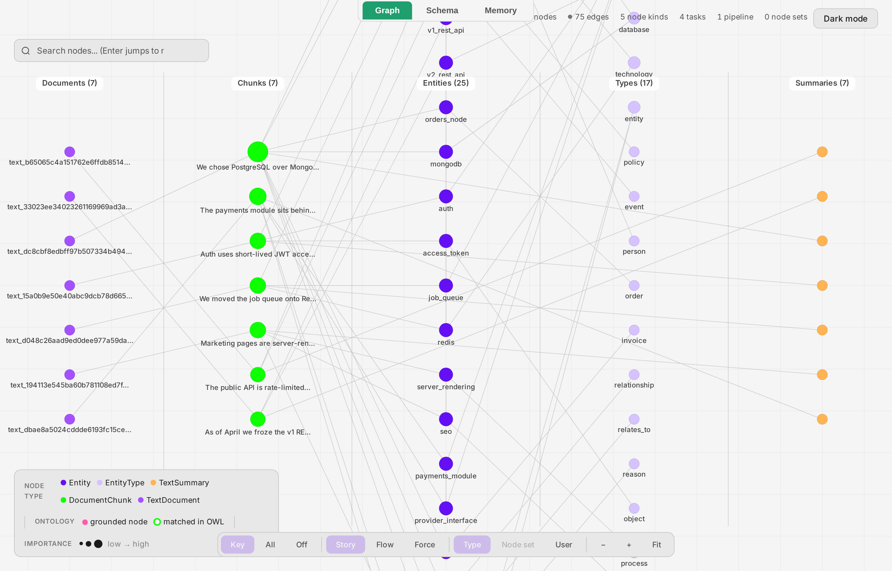

# 🧠 Lore — the memory your codebase keeps

> Every new session, your AI assistant forgets why your project is the way it is.
> **Lore** remembers — the decisions, the trade-offs, and the *why* behind them.

**🎥 3-minute demo:** https://youtu.be/Y0ZuWuzvL68 — every claim below, shown end to end.

Lore is a **persistent, self-hosted memory for a codebase's decisions**. You tell it what you
decided and why ("we chose Postgres over Mongo because our data is relational"); it uses
[**Cognee**](https://www.cognee.ai)'s open-source hybrid **graph + vector** memory to build a
queryable knowledge graph. Weeks later — or in a brand-new session after a full restart — you
ask *"why did we choose Postgres?"* and it answers from memory — connecting facts across
separate notes that no single note states outright.

**In one line:** the tribal knowledge that normally lives in people's heads and dies when they
leave — given a memory that never forgets.

Built for the **WeMakeDevs × Cognee hackathon** ("The Hangover Part AI: Where's My
Context?"), targeting **Best Use of Open Source**. It runs **100% locally, $0, no API keys** —
self-hosted Cognee + Ollama.



---

## The problem it solves

Every developer has asked *"wait, why did we do it this way?"* — and every AI coding assistant
asks it too, on every single session. LLMs are **stateless**: a new chat forgets the last one,
and the context window overflows long before your project's history fits in it. So the *why*
behind your architecture lives in people's heads, buried PRs, and stale docs — and it's lost
the moment someone leaves or you simply forget.

The fix is a **permanent, self-hosted, hybrid graph-vector memory** that an agent can retain,
connect, and carry across infinite sessions. Lore is that memory, pointed at the context
developers lose most: **why the code is the way it is.**

## The hero: memory that survives a restart

This is the whole point of the theme, so Lore makes it literal:

1. Tell Lore your project's decisions in one session.
2. **Kill the process entirely.** Reopen in a fresh session.
3. Ask *"why don't we use cookie sessions?"* — it still answers, *"because the mobile app can't
   hold cookies, so auth uses JWT."*

No context in the new session. No re-explaining. Cognee persisted the graph to disk, and the
memory is simply *there*. That's the thing a plain LLM chat can never do.

## Beyond the demo — where this is actually useful

The built-in demo is a project's decision log, but the same remember-and-recall engine applies
wherever a team's context is scattered and easily lost:

- **Onboarding** — a new engineer asks the codebase *why*, instead of interrupting three people.
- **Architecture decision records** — living, queryable ADRs instead of markdown nobody reads.
- **Incident learnings** — remember what an outage taught you so it isn't relearned the hard way.

The common thread: **persistent memory of the decisions a team can't afford to forget.**

## How it uses Cognee (the whole memory lifecycle — not a wrapper)

Every memory operation goes through Cognee's named lifecycle APIs, over its **hybrid
graph-vector memory layer**:

| Lore action | Cognee API | What it does |
|---|---|---|
| Commit a decision to memory | **`remember()`** | ingest + build the graph-vector memory |
| Ask the codebase *why* | **`recall()`** | graph-grounded answers via graph traversal |
| Connect the dots | **`improve()`** | enrich / cross-link related decisions |
| Wipe the memory | **`forget()`** | erase everything |
| See the memory | **`visualize_graph()`** | live interactive knowledge graph |

Cognee is the brain. The local LLM only phrases answers over what Cognee retrieves.



## Features

- **♻️ Cross-session memory** — the headline: decisions persist across restarts, so a new
  session already knows *why*.
- **💬 Ask the codebase *why*** — natural-language questions, answered from the graph.
- **🧩 Multi-hop recall** — connects facts across separate notes ("mobile can't hold cookies"
  → "so auth uses JWT") that no single note states outright.
- **🕸️ Live memory graph** — an interactive visualization of exactly what it remembers.

## Architecture

```
 Browser UI (vanilla JS)
        |  decisions / questions
        v
 FastAPI  -->  backend/memory.py  -->  Cognee  (remember / recall / improve / forget)
                                          |
                          +---------------+----------------+
                          v               v                v
                    Kuzu graph store   vector store    Ollama (local LLM + embeddings)
```

**How a decision flows through the system:**

- **Writing memory — `remember()`** — the browser stages decision notes and posts them to
  FastAPI, which calls `memory.remember()`. Cognee ingests each note, uses the local Ollama
  model to extract entities and relationships, and writes them into **both** stores: the Kuzu
  knowledge graph (nodes + edges) *and* the vector store (embeddings). A marker file under
  `data/` records that memory now exists on disk.
- **Reading memory — `recall()`** — a natural-language question goes to `memory.recall()`.
  Cognee retrieves over the **hybrid** layer: vector search finds semantically relevant chunks,
  graph traversal follows the relationships between them, and the local LLM phrases a grounded
  answer over only what was retrieved. The graph is what makes **multi-hop** answers possible —
  connecting *"mobile can't hold cookies"* to the JWT decision across two separate notes.
- **Enriching — `improve()`** — cross-links related decisions so later recalls traverse more
  connections.
- **Persistence** — Kuzu and the vector store live **on disk**, not in process memory. Kill the
  server and every byte of context survives; a fresh process reads it straight back. This is the
  feature the hackathon theme is about, and it's verified against a real `kill`.
- **Swappable core** — every operation goes through the thin `backend/memory.py` wrapper, so the
  entire memory engine sits behind four verbs and could be re-pointed without touching the app.

Everything routes through `backend/memory.py`, so the memory backend is swappable.

## Quickstart (local, no OpenAI)

```bash
# 1. Local models via Ollama
ollama serve
ollama pull qwen2.5:3b          # LLM (fast, good at structured output)
ollama pull nomic-embed-text    # embeddings

# 2. Python env + deps
python3 -m venv .venv && source .venv/bin/activate
pip install -r requirements.txt

# 3. Config (Ollama for both LLM and embeddings, see .env.example)
cp .env.example .env

# 4. Prove the local loop end-to-end
python prove_loop.py

# 5. Run the app
uvicorn backend.main:app        # open http://localhost:8000
```

## Tech stack

- **Memory:** Cognee 1.2.2 (self-hosted, Apache-2.0) — Kuzu graph + built-in vectors
- **LLM & embeddings:** Ollama (`qwen2.5:3b`, `nomic-embed-text`) — fully local
- **Backend:** FastAPI · **Frontend:** vanilla JS

## Notes

- Runs entirely on CPU with no GPU required; local inference is ~60-90s/query.
- Config lives in `.env` (`.env.example` documents every key, incl. the Ollama tokenizer,
  `json_schema_mode` for reliable structured output, and `CACHING=false`).
- `prove_loop.py` runs the whole remember → recall loop from the terminal, no UI needed.
